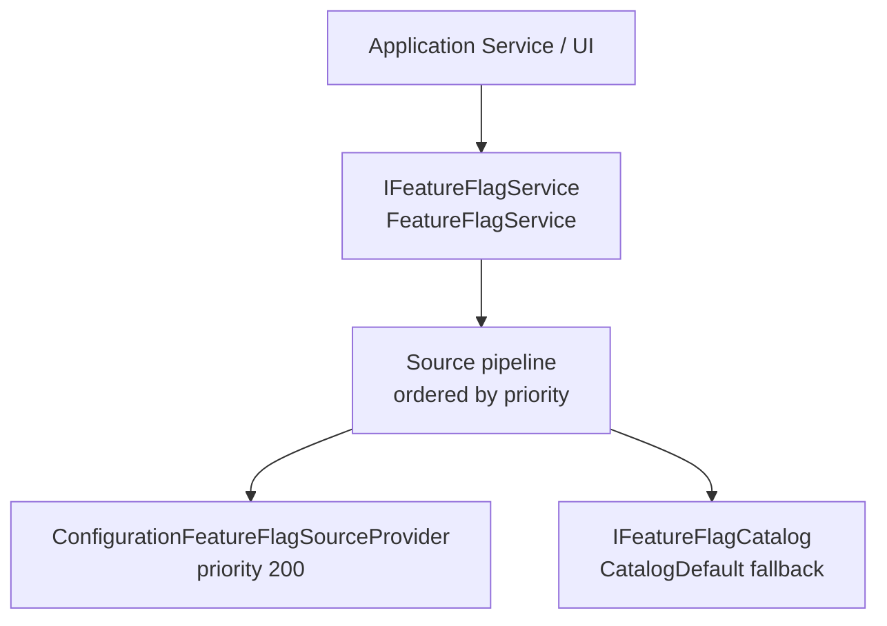

# Feature Flag Architecture

Feature flags control whether application capabilities are available. The system is provider-neutral: application code consumes `IFeatureFlagService` and never depends directly on a specific source such as configuration files, a database, or a remote service.



## Core Concepts

### Feature Catalog

The catalog (`IFeatureFlagCatalog`) holds all registered `FeatureFlag` definitions. Each definition has:

- **Key** — stable dot-notation string, e.g., `Query.Editor`.
- **DisplayName** and **Description** — for diagnostics and admin UIs.
- **Category** — the application area (`Explorer`, `Query`, `Diagram`, `DataEditing`, `Providers`, `Infrastructure`).
- **DefaultEnabled** — value used when no source defines the flag. Most existing features default to `true`; rollout-gated preview features can default to `false`.
- **Lifecycle** — `Planned`, `Development`, `Preview`, `GenerallyAvailable`, `Deprecated`, `Retired`.
- **DependsOn** — optional list of keys that must also be enabled.

All feature keys are defined in `FeatureKeys` and all definitions in `ApplicationFeatures.All`.

### Feature Evaluation

`IFeatureFlagService.EvaluateAsync` walks the registered source providers in priority order. The first provider that returns `Enabled` or `Disabled` wins. When no source defines the flag, the catalog default is used.

The result is a `FeatureFlagResult` containing:

- `IsEnabled` — the effective Boolean value.
- `WinningSource` — the source that produced the value, or `CatalogDefault`.
- `UsedCatalogDefault` — whether the default was applied.
- `EvaluationTrace` — all sources consulted in order.
- `Warnings` — non-fatal issues (invalid values, unavailable sources).

### Source Providers

Each `IFeatureFlagSourceProvider` returns a `FeatureFlagSourceResult` with an outcome:

| Outcome | Meaning |
|---------|---------|
| `Enabled` | Source defined the flag as enabled. Pipeline stops. |
| `Disabled` | Source defined the flag as disabled. Pipeline stops. |
| `NotDefined` | Source has no opinion. Pipeline continues to the next source. |
| `SourceUnavailable` | Source is temporarily unavailable. Warning recorded; pipeline continues. |
| `InvalidValue` | Source value cannot be parsed. Warning recorded; pipeline continues. |
| `Error` | Source threw an exception. Warning recorded; pipeline continues. |

### Source Priority

Lower numbers have higher precedence. Built-in bands:

| Band | Range | Use |
|------|-------|-----|
| Emergency override | 0–99 | Future: runtime kill switches |
| Remote / database | 100–199 | Future: database-backed source |
| Configuration | 200–299 | `ConfigurationFeatureFlagSourceProvider` (default 200) |
| Catalog default | `int.MaxValue` | Always last; uses `DefaultEnabled` |

### Failure Behavior

Controlled by `FeatureFlagOptions.DefaultFailureBehavior`:

- `UseCatalogDefault` (default) — falls back to the catalog `DefaultEnabled` when all sources fail or are undefined.
- `FailClosed` — returns `false` when all sources fail and no catalog default is considered.

## Configuration Source

Feature flags can be controlled via application configuration (JSON settings, environment variables, Aspire configuration, etc.):

```json
{
  "OakIdeas": {
    "Aspire": {
      "DataExplorer": {
        "FeatureFlags": {
          "Query.Editor": true,
          "DataEditing.Insert": false
        }
      }
    }
  }
}
```

Only `true` and `false` (case-insensitive) are valid values. Invalid values produce a warning and are treated as not-defined.

## Registration

```csharp
builder.Services
    .AddFeatureFlags()
    .AddConfigurationFeatureFlagSource();
```

This registers:

- `IFeatureFlagService` → `FeatureFlagService`
- `IFeatureFlagCatalog` → `FeatureFlagCatalog` (seeded with `ApplicationFeatures.All`)
- `ConfigurationFeatureFlagSourceProvider` at priority 200

## Settings Center Integration

Feature flag overrides are exposed through **Settings → Feature Flags** at `/settings/feature-flags`.

The legacy `/feature-flags` route remains available as a compatibility redirect to the Settings section.

## Feature Inventory

Feature defaults are explicitly declared in the catalog:

| Key | Display Name | Category | Default |
|-----|-------------|----------|---------|
| `Explorer.ObjectExplorer` | Object Explorer | Explorer | `true` |
| `Explorer.ObjectDetails` | Object Details | Explorer | `true` |
| `Explorer.SchemaMigrations` | Schema and Migrations | Explorer | `false` |
| `Query.Editor` | Query Editor | Query | `true` |
| `Query.AutoExecute` | Auto-Execute | Query | `true` |
| `Query.ExecutionPlan` | Execution Plan | Query | `true` |
| `Diagram.DatabaseDiagram` | Database Diagram | Diagram | `true` |
| `DataEditing.Insert` | Data Insert | DataEditing | `true` |
| `DataEditing.Update` | Data Update | DataEditing | `true` |
| `DataEditing.Delete` | Data Delete | DataEditing | `true` |
| `Providers.MultipleDatabases` | Multiple Databases | Providers | `true` |
| `Telemetry.RequestTrace` | Request-to-Database Trace | Telemetry | `false` |

## Distinction from Provider Capabilities and Authorization

- **Feature flag** — does the application intend to expose a capability?
- **Provider capability** — can the active database provider perform it?
- **Authorization** — is the current user permitted to perform it?
- **Validation** — is the current request well-formed?

These are independent. A feature should only be usable when all required conditions are satisfied.

## Adding a New Feature

1. Add a constant to `FeatureKeys`.
2. Add a `FeatureFlag` definition to `ApplicationFeatures` (set `DefaultEnabled` explicitly).
3. Register it in `ApplicationFeatures.All`.
4. Add tests validating the catalog entry.
5. Enforce it at the service layer before exposing to the UI.
