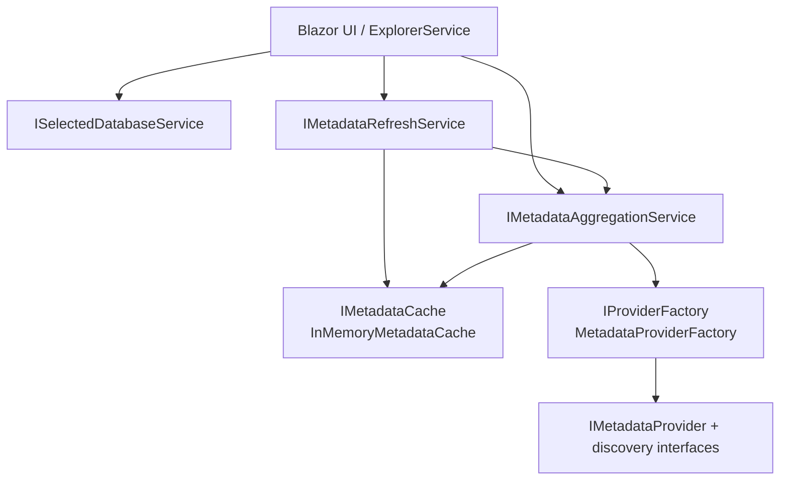

# Metadata Discovery Architecture

Metadata discovery is implemented as a provider-driven aggregation pipeline in `Core`, with provider-specific discovery logic isolated in provider projects (SQL Server for MVP).



## Discovery flow

1. `ExplorerService.GetDatabaseMetadataAsync` resolves selected database context.
2. `MetadataAggregationService` checks `IMetadataCache` by `(resourceId, databaseName)`.
3. On cache miss, a provider is resolved through `IProviderFactory`.
4. Required discovery (`schemas`) runs first.
5. Optional discovery fan-out runs for tables, views, procedures, functions, and triggers.
6. Table/view detail fan-out runs for columns plus optional keys, indexes, and constraints.
7. Results are normalized into `DatabaseMetadataRoot` and `DatabaseMetadata`.
8. Collection status is reported as `Success`, `PartialSuccess`, or `Failed` with failure details.

## Request/response contract pattern

All discovery operations use explicit request/response contracts from `Contracts/Models`.

```csharp
var tables = await tableProvider.DiscoverTablesAsync(
    resource,
    new DiscoverTablesRequest(SchemaName: "dbo"),
    cancellationToken);

var columns = await columnProvider.DiscoverColumnsAsync(
    resource,
    new DiscoverColumnsRequest(ObjectId: table.ObjectId, ObjectType: DatabaseObjectType.Table),
    cancellationToken);
```

This keeps service orchestration provider-agnostic while allowing provider projects to evolve independently.

## Caching and refresh model

- `InMemoryMetadataCache` is the first cache implementation.
- TTL is controlled by `MetadataAggregationOptions.CacheTtlMinutes`.
- Refresh invalidates cache, re-aggregates metadata, and only performs a fallback cache write when aggregation has not already restored the latest snapshot.
- Refresh is single-flight per service instance (`SemaphoreSlim`) to prevent concurrent refresh collisions.

## Failure and diagnostics model

- Required discovery failures fail the operation.
- Optional discovery failures are captured as `MetadataCollectionFailure` and return partial results.
- Errors are mapped through `IErrorHandler` into sanitized `DataExplorerError` payloads.
- Provider-specific exception interpretation stays in provider projects (`IProviderErrorMapper`).

See also:

- [Architecture overview](./overview.md)
- [Provider model](./provider-model.md)
- [Error handling and diagnostics](./error-handling.md)
- [ADR 0005: Metadata discovery aggregation, cache, and partial-failure strategy](../decisions/0005-metadata-discovery-aggregation.md)
- [ADR 0007: Metadata refresh single-flight and cache invalidation](../decisions/0007-metadata-refresh-single-flight.md)
