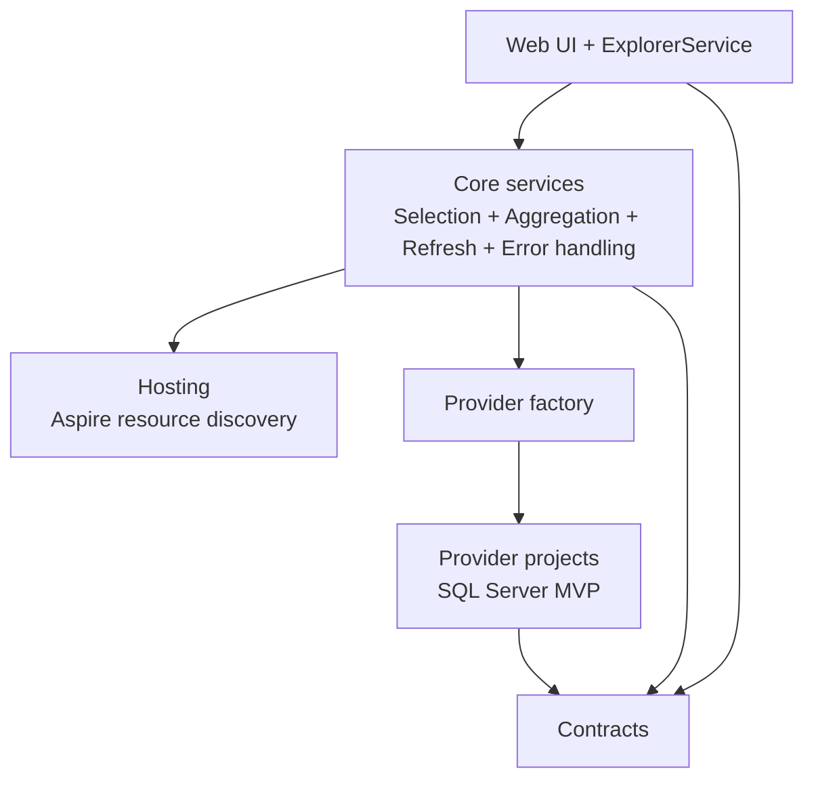

# Architecture Overview

OakIdeas.Aspire.DataExplorer is split into UI, orchestration, contracts, and provider layers.

- `Web` hosts the Blazor Server UI.
- `Core` contains abstractions and domain services.
- `Contracts` contains request/response DTOs.
- `Data` contains provider-independent data helpers.
- `SqlServer` contains SQL Server provider logic.
- `Hosting` contains Aspire integration extensions and resource discovery.
- `AppHost` orchestrates local development resources.

## Metadata discovery components

- `IAspireResourceDiscovery` (Hosting) discovers database resources.
- In the Web runtime, discovery reads Aspire-provided `ConnectionStrings` configuration entries and projects them into discovered database resources.
- `ISelectedDatabaseService` (Core) manages scoped selected-database context.
- `IMetadataAggregationService` (Core) coordinates provider discovery and normalization.
- `IMetadataCache` (Core) stores metadata snapshots by resource/database key.
- `IMetadataRefreshService` (Core) invalidates cache and orchestrates refresh.
- `IProviderFactory` (Core) resolves concrete providers registered via options.

See [Metadata discovery architecture](./metadata-discovery.md) for detailed flow and contracts.

## Query execution flow

- `QueryPage` calls `IExplorerService.ExecuteQueryAsync` for ad-hoc SQL execution.
- `ExplorerService` validates selected database state, applies `DataExplorerOptions` guardrails (ad-hoc enablement, read-only mode, max rows, timeout), and routes execution through `IProviderFactory`.
- Provider implementations (SQL Server MVP) own SQL execution details and result-shape normalization.
- User-visible failures are mapped through `IErrorHandler` and provider error mappers to avoid leaking secrets.

## Metadata presentation conventions

- Object Explorer and Explorer details use compact parenthetical metadata formatting for consistency.
- Common column metadata uses the `ViewColumns` icon; PK/FK/parameter metadata uses semantic icons (`Key`, `Link`, `AtSymbol`).
- Scrollbar styling is shared across UI surfaces (Object Explorer, details panels, query results, and execution-plan containers) to keep visual behavior consistent.

## Error handling and diagnostics

Error categorization and sanitized diagnostics are documented in [error-handling](./error-handling.md).

- `IErrorHandler` creates safe `DataExplorerError` payloads.
- Provider-specific exception mapping stays in provider projects through `IProviderErrorMapper`.
- UI surfaces recovery suggestions and optional diagnostic metadata without exposing secrets.

## Development-only boundary

DataExplorer is intentionally development-only. Runtime and hosting guards are documented in [development-only-boundary](./development-only-boundary.md).

## Solution virtual folder layout

| Folder | Projects |
|---|---|
| `01 - Packages` | Hosting, Contracts, Web.Components |
| `02 - Services` | Web |
| `03 - Data` | Data, SqlServer |
| `04 - Core` | Core |
| `01 - Packages/Tests` | Web.Components.Tests |
| `02 - Services/Tests` | Web.Tests |
| `03 - Data/Tests` | Data.Tests, SqlServer.Tests |
| `04 - Core/Tests` | Core.Tests |
| `06 - Orchestration` | AppHost |
| `07 - Tests` | Solution-wide tests (for example: IntegrationTests) |
| `08 - Samples` | Sample.AppHost, Sample.Api, Sample.Web, Sample.Web.Components |
| `08 - Samples/Tests` | Sample.Web.Components.Tests |

Sample projects remain grouped under `08 - Samples` and do not need to follow the numbered non-sample folder organization.
